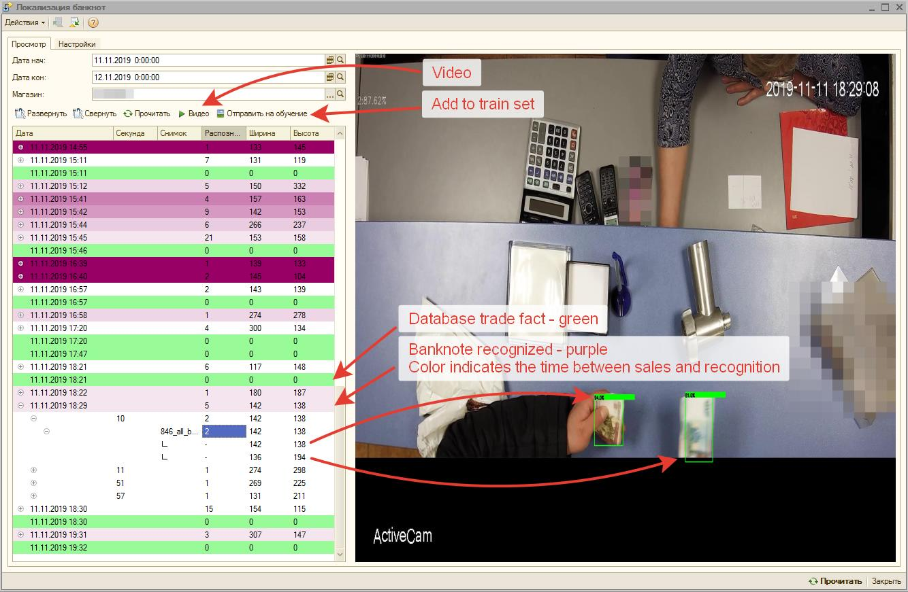

# tensorflow object detection banknotes model
- trained by tutorial:
https://pythonprogramming.net/custom-objects-tracking-tensorflow-object-detection-api-tutorial/

- Then video stream detection from this tutorial:
https://pythonprogramming.net/video-tensorflow-object-detection-api-tutorial/

# Installation
1. install tensorflow
https://github.com/tensorflow/models/blob/master/research/object_detection/g3doc/installation.md
2. from /home/alex/.local/lib/python3.6/site-packages/tensorflow/
git clone https://github.com/tensorflow/models.git

# Training
```
#put 90% images in images/train/ and 10% images in images/test/
python3 xml_to_csv.py
python3 generate_tfrecord_test.py --csv_input=data/test_labels.csv  --output_path=data/test.record
python3 generate_tfrecord_train.py --csv_input=data/train_labels.csv  --output_path=data/train.record

#from /home/alex/.local/lib/python3.6/site-packages/tensorflow/models/research
export PYTHONPATH=$PYTHONPATH:`pwd`:`pwd`/slim

#from /home/alex/.local/lib/python3.6/site-packages/tensorflow/models/research/object_detection
#download model and config
tar xvzf modelFile

#in configuration file, updete: PATH_TO_BE_CONFIGURED, num_classes, batch_size, pbtxt paths
#copy train.py from legacy to models/research/object_detection/
python3 train.py -logtostderr -train_dir=training -pipeline_config_path=training/faster_rcnn_nas_coco.config -num_clones=6 -ps_tasks=1

#from /home/alex/.local/lib/python3.6/site-packages/tensorflow/models/research/object_detection
tensorboard --logdir='training'
```

# Building inference graph
```
sh inference.sh
```
# Using
```
python3 bankopencv.py
```
commented features:
- open from image
- open from web camera
- stream to window

# Add store
```
1. detection_9_off.py  
add shop names:  
shop_names      = ["Altuf","Avangard","Mar","Tag","Sklad","SkladSM1","SkladSM2"]  
2. data_prepare.py  
add shop names:  
shop_names=["Altuf","Avangard","Mar","Tag","Sklad","SkladSM1","SkladSM2"]  
3. mkdir /media/alex/7274516274512A5D/rcimages/6  
4. mkdir /media/alex/7274516274512A5D/rcimages/6/boxed  
5. mkdir /media/alex/7274516274512A5D/rcimages/6/original  
```

# Result

